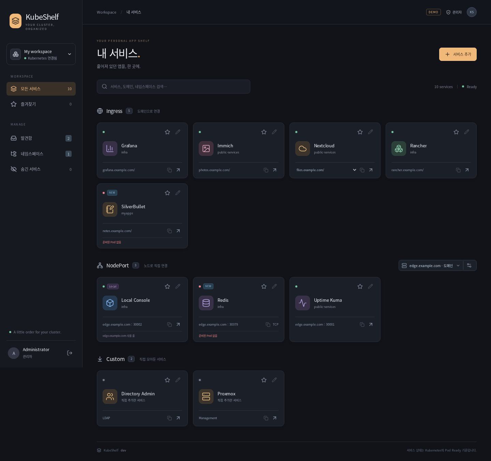

# KubeShelf

A dashboard that discovers Kubernetes Ingress and NodePort services, alongside your own links. One shelf for your cluster, with namespace defaults and per-user or per-group visibility.



## What it does

- Finds Ingress URLs and groups aliases that resolve to the same namespace, Service and port. Override names, icons, URLs, grouping and visibility.
- Offers one NodePort node/domain selector. Services using `externalTrafficPolicy: Local` keep their last eligible node when the selected node has no Ready backend.
- Shows health from Kubernetes Pod Ready and EndpointSlice data. It does not probe web applications. Unknown or unavailable cluster data stays unknown.
- Supports manual services, search, favorites, remembered addresses, copying links, hiding/restoring cards, and an explicit discovery review inbox.
- Shows namespaces only while they have discovered Ingress or NodePort endpoints. Existing namespaces return automatically when endpoints are added; unconfigured ones remain admin-only until reviewed.
- Supports optional visitor login through OIDC and an authentik user/group directory. Administrators are identified by stable OIDC subjects, not mutable display names.
- Filters unauthorized addresses and node information on the server before returning the catalog. This controls dashboard visibility; destination applications still need their own access control.

## Local demo

Requires Node 24, Go 1.25+ and Git. The demo uses synthetic data and needs no Kubernetes, authentik or Git server.

```sh
cd web
npm ci --ignore-scripts
npm run build
cd ..
KUBESHELF_DEMO=true KUBESHELF_PUBLIC_URL=http://localhost:8080 go run ./cmd/kubeshelf
```

Visit `http://localhost:8080`. The login button opens a demo administrator session. Never enable demo mode on a production deployment.

## Install with Helm

```sh
helm repo add kubeshelf https://colah16.github.io/KubeShelf
helm repo update
helm upgrade --install kubeshelf kubeshelf/kubeshelf \
  --version 0.1.1 --namespace public-services --values private-values.yaml
```

See [example values](examples/values.yaml), [chart defaults](charts/kubeshelf/values.yaml) and the [operations guide](docs/operations.md). Production requires an existing runtime ConfigMap, SSH credentials and pinned host keys, OIDC client credentials, and an authentik directory token. These belong in your private GitOps repository.

The public repository contains application source, a container build and a reusable Helm chart. Tagged releases publish `ghcr.io/colah16/kubeshelf` for AMD64 and ARM64, and update the GitHub Pages Helm repository. Keep actual domains, user IDs, scheduling preferences, secrets and volume definitions outside this repository.

## Configuration lifecycle

```text
Editor → validate → Git commit and immediate push → Fleet reconciliation
       → ConfigMap projection → application reload → applied revision confirmed
```

Saving waits for the push and prevents overlapping saves. Editing can continue while Fleet applies a saved revision. The live catalog and permissions change only after the mounted ConfigMap changes. There is no timed batch of Git pushes or periodic application Git polling. Fleet's polling interval is only one part of propagation time; kubelet projection adds delay.

The application runs as one replica with ephemeral Git working storage. Configuration is durable in Git; it needs no database or persistent volume. Browser preferences are local to each identity. Sessions are held in memory and require a new login after restart.

## Development

```sh
cd web && npm test && npm run build && cd ..
go test ./...
go vet ./...
helm lint charts/kubeshelf --set demo=true --set publicURL=http://localhost:8080
```

Kubernetes discovery refreshes every 10 seconds; the browser refreshes every 5 seconds. Runtime configuration is reread every second. The implementation currently targets one cluster and an authentik-backed user/group directory.
